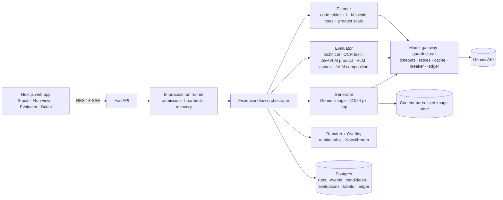

# Ad Studio

[](https://github.com/Aumshah45/Ad-Studio/actions/workflows/ci.yml)

**Enriching image generation with structured context — and *guaranteeing* the quality of what ships.**

Ad Studio turns a **reference product photo** plus three structured fields — **target geography**, **season**, and
**text that must appear** — into a localized display ad at most **1024 px** on the long edge, generated with
**Gemini 3.1 Flash-Lite / Flash Image**. It is built for a regional marketer localizing one product ad across many
markets, where getting the season, the product and the on-image copy *exactly* right matters for every variant.

**At a glance:** 100% of shipped ads carry the exact required text · evaluator recall 1.00 on all five quality
dimensions · $0.088 and 48.6 s per approved ad · 543 automated tests, all offline · every metric reproducible from a
clone, without an API key.

---

## Why this project

Text-to-image models are good at pictures and unreliable at the things a real ad campaign is judged on: rendering
"30% OFF" without a wrong digit, keeping the product on-brand, and respecting that **December in Australia is summer**.
The interesting question is not "can a model generate an ad?" but **"can you *guarantee* the quality of what ships?"**

Ad Studio's answer is to make quality **part of generation, not an afterthought**: resolve context deterministically,
score every draft against a spec on five dimensions, repair what fails, guarantee the text as a last resort, and keep a
human at the release gate — then **measure the evaluator itself** against blind human labels and planted failures, and
feed what it gets wrong back into both the evaluator and the generator.

## How it works



The pipeline is a **fixed workflow** (not an agent) — the steps are known in advance, so code decides the order, which
makes it cheaper, deterministic and testable offline:

1. **Resolve context (code).** ISO country + season/holiday tables compute the *effective season* with a rationale
   ("December, southern hemisphere → summer"), and a realistic product scale from the reference's real-world size.
2. **Plan.** A text model adds only locale cues (it never sees the required text); code builds the `CreativeSpec`
   — palette, lighting, setting, a reserved text-safe zone, and provable line breaks.
3. **Generate.** Two Flash-Lite drafts, prompted to *photograph the product in the scene* (contact shadow, matching
   light and perspective, realistic size) rather than composite it in.
4. **Evaluate on five dimensions** — *technical, text, product, context, composition.* Deterministic checks run first
   (two-engine OCR, colour ΔE, resolution), then a vision judge that can **veto but not pardon**.
5. **Repair.** A routing table picks one targeted Flash edit for the specific failure (≤ 2 repairs).
6. **Guarantee the text.** If text still fails, the exact string is drawn into the reserved zone with Noto/libraqm and
   re-verified by OCR — the native-render rate is reported separately, so the overlay never hides model quality.
7. **Release.** The gate proposes; a **human approves** the export (or overrides with a written reason, stored as a label).

## Results

Evaluator of record: **ev-0.8, frozen**. All numbers are reproducible offline from the committed golden sets and cached
verdict snapshots (`make eval`), with network access blocked.

| | Target | Achieved (golden **v2**) |
|---|---|---|
| Evaluator **recall** (technical / text / product / context / composition) | ≥ 0.90 each | **1.00 / 1.00 / 1.00 / 1.00 / 1.00** |
| Evaluator **precision** | ≥ 0.85 each | 1.00 except **text 0.79** — all 4 false alarms are disputed labels |
| Agreement with the human labeller (Cohen's κ) | ≥ 85% | **90%** (κ 0.62) |
| Shipped ads with **exact** required text | 100% | **100%** (19/19 native; 1 adversarial brief uses the overlay by design) |
| Outputs ≤ 1024 px | 100% | **100%** (enforced at write time *and* as a DB constraint) |
| Cost per approved ad · p50 latency | ≤ $0.25 · ≤ 60 s | **$0.088 · 48.6 s** |
| Network calls during `make check` / `make eval` | 0 | **0** |

**Unseen hard cases (v3):** 16 briefs picked and committed *before* generation — crowds, geography/season traps
(NZ Christmas, Iceland midnight sun), non-Latin scripts (Korean, Thai, Arabic RTL, Eastern-Arabic digits), tricky
prices — scored with the *frozen* evaluator: **15/16 shipped at 100% exact text, $0.096/ad, 40.6 s p50, 16/16
first-draft agreement.** The live repair loop fixed **3 of 4** targeted failures in a single Flash call and salvaged
**4 of 6** failing drafts.

**The composition fix, rated by the human:** a review of the first run exposed oversized, pasted-on products; deriving
product scale from real-world size took composition pass rate **55% → 100%** and context **85% → 100%** in v2.

> Honest limitation: text precision (0.79) misses its 0.85 target. Every one of the four false alarms is a *disputed*
> label (the model drew a prompt line-break marker or a stray quote the labeller accepted); they are reported as
> disputed rather than relabelled to hit the number. Full limitations in [`TECHNICAL_REPORT.md`](TECHNICAL_REPORT.md#8-limitations-and-next-steps).

## Engineering highlights

- **One model gateway for every call** (image, vision, text, even OCR): per-call timeouts, retries on 429/5xx only,
  never on safety blocks, a circuit breaker, a cache, and a `model_calls` ledger — so cost and latency come from
  recorded rows, not estimates.
- **Event-sourced runs:** `POST /v1/runs` returns 202; each state change is written with its event in one transaction,
  and the UI tails SSE with `Last-Event-ID` replay, so a closed tab loses nothing.
- **Content-addressed image store** (sha256), with the 1024 px cap enforced at the single write point and again by a
  database check constraint.
- **The golden set lives in git**; the database is a projection of it. Evals replay cached verdicts with sockets
  blocked, so anyone can reproduce the metrics from a clone without an API key.
- **Guardrails:** only the required text can reach a model (as one escaped line); injection-looking text is routed
  straight to the overlay; images go to Google models only; 11 automated red-team cases.

**Stack:** Next.js (App Router, TypeScript strict, shadcn/ui) · FastAPI (Python 3.13, `uv`) · Postgres + pgvector ·
Gemini 3.1 Flash-Lite / Flash Image · Tesseract + Apple Vision OCR · Pillow + libraqm overlay.

## Repository layout

```
apps/web/          Next.js app — Studio, live run view, evaluator dashboard, batch gallery, /status
services/api/      FastAPI — pipeline, evaluator, model gateway, guardrails, migrations, tests, eval suites
data/golden/       Golden dataset — 5 products, 20 briefs ×2 runs, 42 planted failures, v3 unseen set, human labels
docs/              Design docs — PRD, architecture, AI design, UX, production readiness, test results
TECHNICAL_REPORT.md   Full write-up: design, rationale, success criteria, results, limitations
HOW_IT_WAS_BUILT.md   How I directed a coding agent to build it, and what I decided myself
```

## Quick start

```bash
make setup     # install deps, create databases, run migrations
make dev       # web → http://localhost:3000 (Studio, /batch, /evals, /status); API on :8000
make check     # ruff, pyright, pytest (offline), eslint, tsc, vitest, contract drift
make eval      # offline eval report from the committed golden set (no API key needed)
```

Copy `.env.example` to `.env`. With `IMAGE_CLIENT=fake VISION_CLIENT=fake` the whole flow runs **without a key**; live
generation needs a `GOOGLE_API_KEY` from a billed Google AI Studio project (about $1.75 per 20-brief run).

📋 **Full step-by-step run instructions** — prerequisites, offline vs live modes, running the app, tests and evals —
are in **[`docs/instructions-to-run.md`](docs/instructions-to-run.md)**.

> **Clone the repository** to run `make eval` or the full test suite: it contains the full golden dataset, including
> the generated output images. The source ZIP omits those large folders to keep the download small.

## Learn more

- **How to run it** — prerequisites, offline vs live, tests, evals: [`docs/instructions-to-run.md`](docs/instructions-to-run.md)
- **Full write-up** — design, rationale, success criteria, results, limitations: [`TECHNICAL_REPORT.md`](TECHNICAL_REPORT.md)
- **How it was built** — directing a coding agent with written requirements: [`HOW_IT_WAS_BUILT.md`](HOW_IT_WAS_BUILT.md)
- **Architecture** and **AI design**: [`docs/architecture.md`](docs/architecture.md) · [`docs/ai-design.md`](docs/ai-design.md)
- **Golden dataset** and provenance: [`data/golden/`](data/golden/) · [`SOURCES.md`](data/golden/SOURCES.md)
- **Test results** and **eval reports**: [`docs/test-results.md`](docs/test-results.md) · [`services/api/evals/reports/`](services/api/evals/reports/)
