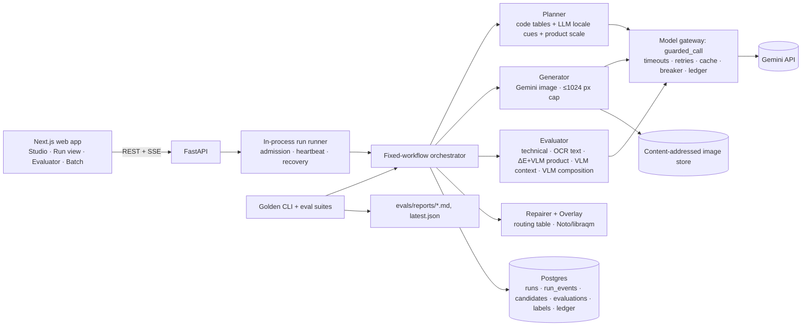

# Ad Studio — Enrichment of image generation using structured context

Ad Studio turns a **reference product photo** plus three structured fields (**target geography**, **season**, and
**text that must appear in the ad**) into a display ad of at most 1024 px on the long edge. It uses **Gemini 3.1
Flash-Lite Image** for drafts and **Gemini 3.1 Flash Image** for targeted repairs. Its answer to the central question
("how do you *guarantee* generation quality?") is to make quality part of generation rather than an afterthought:
- **Resolve context first.** A hemisphere-aware planner turns the fields into a creative spec (Australia + December →
  *summer*), including a realistic product scale.
- **Score every draft against that spec on five dimensions:** technical, text, product, context and composition.
  Deterministic checks run first (OCR, colour ΔE, technical), then a vision judge.
- **Repair what failed.** The pipeline asks for a targeted fix of the specific failure.
- **Guarantee the text.** If the text is still wrong, the exact text is drawn into a reserved text zone and
  re-verified by OCR.
- **Keep a human in the loop.** The quality gate proposes, and a human approves the export.
- **Measure the evaluator itself** against blind human labels and 42 planted failures, and use what it gets wrong to
  improve both the evaluator and the generator.

**Headline results.** Evaluator of record: **ev-0.8, frozen** (`evaluator/FROZEN.md`).
- **v2** (20 natural outputs + 42 planted failures,
  [`20260926T073328Z-v2.md`](services/api/evals/reports/20260926T073328Z-v2.md)):
  - recall **1.00 on all five dimensions**;
  - precision **1.00** on product, context and composition, and **0.79 on text** (target 0.85). The 4 remaining text
    false alarms are exactly the 4 disputed labels;
  - **90% agreement** with the human labeller (κ 0.62);
  - known-good controls 4/4, 0 judge flips in 231 checks run twice.
- **v3, unseen hard cases** (16 briefs, never used for tuning, scored with the frozen evaluator,
  [`v3-unseen-2026-09-26.md`](services/api/evals/reports/v3-unseen-2026-09-26.md)):
  - 15/16 shipped with 100% exact text;
  - **$0.096 per ad, 40.6 s** p50;
  - 16/16 agreement on the first drafts.
- **Repair path measured live** on v3's real failing drafts: **3 of 4 targeted Flash repairs fixed the failing
  dimension**, and 4 of 6 drafts were salvaged.
- **Pipeline (v2):** 20/20 briefs shipped with **100% exact text**, 19/19 rendered natively by the model (B20, the
  injection brief, uses the overlay by design). **$0.088 per approved ad**, **48.6 s** p50.
- **Composition before and after the fix (human-rated):** v1 → v2 composition pass rate **55% → 100%**, and context
  **85% → 100%**, after the user's review of v1 exposed oversized, pasted-on products.

---

## 1. Problem and scope
**Problem.** Design and implement a display-ad generation pipeline on Gemini 3.1 Flash-Lite Image or Flash Image that
takes a reference product image plus geography, season and must-include text. Output must be ≤ 1K (long edge
≤ 1024 px). Build an evaluator that judges about 20 pipeline outputs, and show with automated tests that it separates
passing from failing outputs on defined metrics, covering at least context adherence, reference-product fidelity and
text-rendering fidelity. Image models render text imperfectly, so the design has to account for that. The full
statement is in [`docs/problem.md`](docs/problem.md).

**Interpretation.**
- **User:** a regional marketer localising one product ad for many markets.
- **Quality is gated, not hoped for.** Nothing is released without a scorecard and human approval.
- **Test the evaluator itself.** Planted failures with labels known by construction, plus blind human labels, measure
  it directly.

The requirement-by-requirement mapping is the requirements matrix in [`docs/prd.md`](docs/prd.md).

**In scope:**
- the pipeline (plan → generate → evaluate → repair → overlay → approve)
- the evaluator: the three core dimensions (context, product, text) plus **technical** and **composition**
- two labelled 20-brief golden sets (v1 baseline and v2 improved) and 42 planted failures
- an offline, deterministic test suite and eval report
- a web app: studio, live run timeline with evidence, evaluator dashboard, batch gallery
- a security baseline

**Out of scope, with reasons:**
- *Brand kits (fonts/logos per customer):* not needed to answer the core quality question.
- *Fine-tuning or local models:* the model policy is hosted models only.
- *Online A/B/CTR testing:* this needs live traffic, so it appears only as the production story.
- *Multi-tenant auth:* not needed for a demo; the design keeps tenant scoping in the data layer.

## 2. Engineering design

### Architecture

- **Runs** are asynchronous. `POST /v1/runs` (Idempotency-Key required) returns 202. The run executes in-process,
  and every state change is written with its event in one transaction to `run_events`. The UI follows
  `GET /v1/runs/{id}/events` (SSE with `Last-Event-ID` replay), so a closed tab or dropped connection loses nothing
  (ADR-002).
- **Images** are stored content-addressed by sha256, with metadata in Postgres. The 1024 px cap is enforced at the
  single write point and again as a database check constraint
  (ADR-003). Gemini returns 928×1152 at 4:5 "1K", so every
  output is downscaled.
- **The golden set lives in git**, and the database is a projection of it. Evals replay cached model verdicts from a
  file snapshot with sockets blocked, so anyone can reproduce the numbers from a clone without a key
  (ADR-004). Recording verifies itself by replaying its own
  snapshot, and fails loudly if any answer is missing.
- **Every model call** (image, vision, text, even OCR) goes through one gateway. It applies per-call timeouts, retries
  on 429/5xx only, never retries a safety block, uses a circuit breaker and a cache, and writes a ledger row with
  cost and `run_id`. Cost and latency per approved ad therefore come from the ledger, not from estimates.

Full design: [`docs/architecture.md`](docs/architecture.md). Its "Cross-doc reconciliation" section is authoritative.

### AI design
**Pattern: a fixed workflow (pattern ladder rung 2), not an agent**
(ADR-001). The steps are known in advance, so code decides the
order. That is cheaper, deterministic and testable offline.

1. **Resolve (code).** An ISO country table (hemisphere, climate, wet months, script) and a season/month/holiday table
   compute the *effective season* with a rationale ("December in the southern hemisphere is summer"). Unknown terms go
   to a constrained model resolver as wrapped untrusted text, or the request is rejected with 422 `unknown-season`
   before any spend (ADR-006).
2. **Plan.** A text model adds locale cues only. It **never sees the required text**. Code builds the
   `CreativeSpec`: palette, lighting, setting, a template text-safe zone, line breaks that provably preserve every
   character, the locale avoid-list and the binary context rubric. **Product scale comes from the product's real-world
   size** (a vision profile of the reference, e.g. tube ≈ 15 cm) and the chosen framing, and everyday reference
   objects of known size are named for the scene (ADR-007).
3. **Generate.** Two Flash-Lite drafts per brief. The prompt has four parts:
   - a product-fidelity block;
   - a "photographed in the scene, not composited" block: contact shadow, the scene's light, matching perspective and
     depth of field, realistic size next to the named objects;
   - an avoid block;
   - the headline copy alone on one line with its line count in words. No delimiter or line-break marker can be drawn,
     a fix made after the first live run drew « » into the ad.
4. **Evaluate.** Deterministic checks first, then the vision model ("veto, not pardon"):
   - *Technical:* decodes, ≤ 1024 px, aspect ratio, not blank, not a copy of the reference.
   - *Text:* two OCR engines, Tesseract (per-script packs incl. Japanese, Hindi, Korean, Thai, Arabic) and Apple
     Vision, plus the vision model's read-back. A text **fail needs two readers to agree**; a lone disagreement
     triggers a higher-resolution re-read and otherwise `unverified`. Both engines read the zone crop and the whole
     image.
     Characters and words in the zone that aren't in the copy count as errors, so **CER = 0 is required**. Numbers,
     prices and short capitals must match exactly, and stray text outside the zone (including legible third-party
     text on props) fails. The vision model's read-back can only *add* failures, because vision models autocorrect
     typos like "Summr".
   - *Product:* the vision judge locates the product; the crop is compared with the reference by CIEDE2000 ΔE on
     dominant colours. Then a vision checklist: shape, brand name and large label text, single instance, is the hero.
     Garbled *small* label text is recorded as a non-failing note, per the labeller's policy, and so is hue drift
     against the reference colours.
   - *Context:* binary questions compiled from the spec and avoid-list. Any single contradiction fails, and season
     cues must be dominant. People must be physically coherent with the product. Answered evidence-first at
     temperature 0.
   - *Composition:* realistic scale (the judge names the scene object of most certain size, gives both sizes in cm,
     and code checks the implied/expected ratio against 0.6–1.25) and natural integration (up to 3 pasted-in signs,
     evidence-first).
   - *Fail closed:* if the judge is down or unsure, the run is never auto-approved.
5. **Repair.** A routing table keyed by the failed check chooses one targeted Flash edit (product, context, composition
   or text), a regeneration, or a clean plate. At most 2 repairs. A repair that returns a near-identical image
   (SSIM ≥ 0.98) stops the loop.
6. **Guarantee the text.** If only the text still fails, Pillow and libraqm draw the exact string with Noto fonts into
   the reserved zone, and it is re-verified by OCR (or by construction for scripts without an OCR pack). The
   native-render rate is reported separately, so the overlay never hides model quality.
7. **Release.** The gate proposes `passed` or `needs_review`. A human approves the export, or overrides a held run
   with a written reason, which is stored as a label.

**Budgets.**
- *Per run:* $0.25 with price reservation before every image call, at most 5 image calls, and a 150 s deadline.
- *Per day:* $3.
- *Per IP:* 10 runs per hour and 2 concurrent.
- *Image calls:* 60 s timeout and no retry on timeout.

Full AI design: [`docs/ai-design.md`](docs/ai-design.md).

**Guardrails.** Only `required_text` is free text that can reach a model, and only the image model, as a single
escaped line.
- **Rejected at input:** control, bidi, tag and zero-width characters (ZWJ/ZWNJ allowed); more than 80 characters or
  more than 3 lines; and blocklisted terms.
- **Injection:** text that looks like an injection skips the image model and goes straight to the overlay, rendered
  literally.
- **Label text in product photos** is data, not instructions.
- **Provider lock:** images go only to Google models; the app refuses to start otherwise.
- **Red-team tests:** 11 automated cases (RT-01…RT-11); see [`docs/production-readiness.md`](docs/production-readiness.md).

## 3. Rationale — key decisions
| Decision | Chosen | Alternatives considered | Why |
|---|---|---|---|
| Pattern | Fixed workflow (rung 2) | Single call; agent with tools | Steps are known; cheaper, deterministic, testable offline |
| Generation strategy | 2 Flash-Lite drafts → ≤ 2 targeted Flash repairs → deterministic overlay | Flash best-of-3; single draft + always overlay | Text is guaranteed at a low cost per ad (ADR-005) |
| Season handling | Code tables first, model only for unknown terms | Model resolves free text | Hemisphere is correct by construction (12/12 test cases) |
| Inputs | ISO country picker + free-text season | Fixed lists; all free text | Correct hemisphere while still accepting "Diwali" or "Día de Muertos" |
| Product scale | Real-world size + framing + named reference objects | Fixed 45–60% of height (v1) | v1 put a 15 cm tube at chair height; human composition pass rate rose from 55% to 100% |
| Composition as its own dimension | Separate scored dimension | Fold into context | The labeller had spread these problems across technical, product and context; a separate column made labels and P/R clean (ADR-007) |
| Judge authority | Veto, not pardon | Vision model decides | Vision models autocorrect typos, and text inside an image can inject instructions |
| Text threshold | CER = 0 including extra zone characters; critical tokens exact | CER ≤ 0.05/0.10; best-window only | A single wrong digit in "30% OFF", or drawn « », is a failed ad |
| Colour check | Weighted ΔE plus a per-dominant-colour limit, as a *supporting* signal | ΔE threshold as the product gate | The analysis showed human fails and passes overlap completely in ΔE, so no threshold separates them |
| Release | Gate proposes, human approves | Auto-release | Brand safety; overrides become labels for measuring agreement |
| Test policy | Tests assert behaviour; targets are reported | Targets gate CI | Avoids tuning thresholds just to turn CI green |
| Calibration | Tune on products P1–P3, report P4–P5 held-out | Tune on everything | Keeps the held-out numbers honest |

The checkpoint decisions are in [`docs/decision-brief.md`](docs/decision-brief.md) and the ADRs.

## 4. Golden dataset
Location: [`data/golden/`](data/golden/). Provenance: [`SOURCES.md`](data/golden/SOURCES.md).
Rubric: [`LABELING.md`](data/golden/LABELING.md).
- **Products (5):** openly licensed photos from Wikimedia Commons, chosen to stress different signals:
  - P1 mug with a red logo panel (CC0)
  - P2 labelled glass bottle (CC BY-SA 4.0)
  - P3 red/white sneakers (CC BY-SA 3.0)
  - P4 plain single-colour bottle (CC BY 2.0)
  - P5 sunscreen tube with small text (CC BY-SA 4.0)

  Each file's author and licence is recorded. Share-alike licences carry over to the derived ads.
- **Briefs (20)** in [`briefs.yaml`](data/golden/briefs.yaml): both hemispheres, including 5 counter-intuitive cases
  (Australia/December, New Zealand/July, South Africa/June, Argentina/September, Australia/Christmas) and a named
  southern season (Brazil/"summer" → Dec–Feb). They also cover tropical, equatorial and arid markets, holidays, prices
  and percentages, diacritics, **Japanese and Hindi**, a 47-character three-line headline, and one adversarial text
  (B20).
- **Two live runs of the same 20 briefs:**
  - **v1** ([`v1/`](data/golden/v1/)): the first live run, with a fixed product scale.
  - **v2** ([`v2/`](data/golden/v2/)): after the composition fix.

  Each run has **E-nat** (the first Flash-Lite draft per brief, before any repair: the ≈20 natural pipeline outputs
  the evaluator is judged on) and **E-final** (the shipped output).
- **Human labels:** one labeller marked pass/fail per dimension for all 80 images on a contact sheet that hides the
  evaluator's verdicts.
  - v1 was labelled first with rubric 1. Composition was added in rubric 2 after the labeller's review.
  - The v1 product/context fails were then reopened with reason codes: 9 product and 5 context fails were really
    scale problems and moved to composition; 3 "people" and 2 "geography" context fails remain.
  - Every change is a separate commit.
- **E-plant (42, v2):** failures planted programmatically in human-labelled all-pass images:
  - text typo 6, text missing 3, stray text 2
  - product recolour 4, product swap 3, product duplicate 2, logo erased 2
  - technical 4
  - composition oversize 3, pasted 3
  - known-good controls 4
  - generated season and geography contradictions 6 (human-verified)

  Pure mutations are reproducible from seeds in `planted/manifest.jsonl`. Product mutations leave composition and
  context unasserted, because their compositing is visible.
- **v3, unseen hard cases (16 briefs,** [`v3/briefs.yaml`](data/golden/v3/briefs.yaml)**):**
  - Picked by the human from an agent-drafted menu, and committed before any image was generated.
  - Groups: people/crowds; geography/season traps (NZ Christmas, Iceland midnight sun); non-Latin scripts (Korean,
    Thai, Arabic RTL, Eastern Arabic digits); tricky prices ("12,99 € – LSF 50+", "CHF 24.90", «…», "FREE*").
  - 12 of the 16 use the held-out products, and none was used for tuning. Labelled by the same human.
  - After blind labelling, the agent pointed out three drafts whose text visibly differs from the copy, and the
    labeller changed those to fail. These three labels are therefore not blind, and the report gives both label
    versions.
- **Splits:** calibration is P1–P3 and held-out is P4–P5. Thresholds are tuned on calibration only.

## 5. Success criteria
| Criterion | Metric | Target | Why this target |
|---|---|---|---|
| Evaluator catches failures | Recall per dimension, positive class = FAIL | ≥ 0.90 each | A missed failure ships a bad ad; recall matters most for a gate |
| Evaluator doesn't cry wolf | Precision per dimension | ≥ 0.85 each | False alarms waste repair budget and reviewer time |
| Evaluator agrees with humans | Overall pass/fail agreement on the 20 natural outputs (+ Cohen's κ) | ≥ 85% | Planted failures alone can overstate an evaluator |
| Quality gate works | After-repair pass rate (first-attempt reported alongside) | ≥ 90% | Shows the gate ships usable ads |
| Text is guaranteed | Shipped ads whose OCR text exactly matches the required text | 100% | Native rendering is imperfect; the product must never ship wrong text |
| Resolution | Outputs with long edge ≤ 1024 px | 100% | Hard 1K output constraint |
| Context refinement | Effective season correct on the hemisphere cases | 100% (12/12) | Hemisphere mistakes are the classic failure |
| Reproducible tests | Network calls during `make check` / `make eval` | 0 | Anyone can re-run everything from a clone |
| Cost | $ per approved ad (generation + judging, including failed attempts) | ≤ $0.25 | Viable at campaign scale |
| Latency | p50 time to an approved ad | ≤ 60 s | Interactive use in the studio |

## 6. Results against the criteria
Evaluator **ev-0.8 (frozen)**, final golden set **v2**, E-nat ∪ E-plant for P/R:
[`20260926T073328Z-v2.md`](services/api/evals/reports/20260926T073328Z-v2.md).

| Criterion | Target | Achieved | Met |
|---|---|---|---|
| Recall technical / text / product / context / composition | ≥ 0.90 | 1.00 / 1.00 / 1.00 / 1.00 / 1.00 | ✅ |
| Precision technical / text / product / context / composition | ≥ 0.85 | 1.00 / **0.79** / 1.00 / 1.00 / 1.00 | ❌ text only (all 4 false alarms are disputed labels) |
| Human agreement on E-nat (κ) | ≥ 85% | **90%** (18/20, κ 0.62) | ✅ |
| After-repair pass rate (first-attempt) | ≥ 90% | 100% (95%) | ✅ |
| Shipped exact text (native-render rate) | 100% | 100% (19/19 native; B20 overlay by design) | ✅ |
| Resolution ≤ 1024 px | 100% | 100% of 40 images; enforced at write time and by a DB constraint | ✅ |
| Hemisphere cases | 100% | 100% (12/12) | ✅ |
| Network calls in tests/eval | 0 | 0 (socket guard; `make check` green) | ✅ |
| $ per approved ad | ≤ $0.25 | **$0.088** | ✅ |
| p50 latency (p95) | ≤ 60 s | **48.6 s** (53.3 s) | ✅ |

**Planted failures:** every class is caught 100%: text typo/missing/stray, product recolour/swap/duplicate/logo-erased,
technical, composition oversize/pasted, and generated season/geography contradictions. **Known-good controls pass
4/4.** The ev-0.7 "Ath" false alarm is gone with the second OCR engine.

### Unseen v3: frozen evaluator, hard cases
Report: [`v3-unseen-2026-09-26.md`](services/api/evals/reports/v3-unseen-2026-09-26.md).

| Metric | v3 |
|---|---|
| Briefs shipped / held for review | 15 / 1 (V12: Arabic with Eastern digits) |
| Shipped exact text | 100% of 15 |
| $ per approved ad · p50 / p95 latency | $0.096 · 40.6 s / 49.4 s |
| Text on first drafts, revised labels: precision / recall | 1.00 / 1.00 (3 true fails caught, 0 false alarms) |
| Text on first drafts, original blind labels (all pass) | 3 false alarms: the labeller first passed everything |
| Overall agreement on first drafts | 16/16 (κ 1.00, revised labels) |

- **Product, context and composition are not measured on v3:** the human found no failure there, so there are no
  positives to catch.
- **V12-final:** the text overlay is correct, but the evaluator's text check reads ٢٥ wrongly, a false alarm. v3 was
  scored on Linux without Apple Vision, and a Mac re-score with the full OCR ensemble is in progress.
- **Product colour** (the pink→red issue, colours now in the prompt): hue drift ≥ 10° on P4 fell from 100% (v1, v2) to
  75% on v3. Better, not fixed.

### Live repair path
Measured with `make golden-repair-probe` on v3's 6 non-passing first drafts. These run the production repair loop:
routing table, Flash repairs, budget, stall guard and overlay.

| Draft | Failed on | Repair | Result |
|---|---|---|---|
| V05 (NZ) | text | targeted Flash text repair | ✅ passed, native text |
| V14 (CH) | context | targeted Flash context repair | ✅ passed |
| V15 (FR) | text (drew ‘…’ for «…») | targeted Flash text repair | ✅ passed, «…» exact |
| V09 (KR) | text unverified | overlay | ✅ passed (overlay) |
| V12 s0 / s1 (EG) | text (Western digits) | repair stalled (SSIM 0.99) → overlay | ❌ held: overlay verification failed (OCR can't read ٢٥٪ on Linux) |

**3 of 4 targeted repairs fixed their dimension in one Flash call, and 4 of 6 drafts were salvaged** ($0.317 total).

### What each evaluator layer contributes (ablation A1, v2)
| Dimension | Deterministic only F1 | Vision only F1 | Combined F1 |
|---|---|---|---|
| Text | 0.77 | 0.83 | **0.88** |
| Product | 0.71 (recall 0.55) | 1.00 | 1.00 |
| Composition | — (recall 0.00) | 1.00 | 1.00 |

Combining OCR and the vision read-back beats either alone on text. Product and composition failures need the vision
judge, and colour alone catches only 55% of product failures.

### v1 → v2: the composition fix, measured by the human labeller
| Human pass rate | v1 | v2 |
|---|---|---|
| E-nat composition | 55% | 100% |
| E-final composition | 55% | 100% |
| E-nat context | 85% | 100% |
| E-final context | 90% | 100% |
| E-nat text | 95% | 90% |

On v1's natural outputs, the harder set with real failures, ev-0.8 reaches 80% agreement (κ 0.60), composition
recall 0.78 and precision 0.88, and context recall 0.33 on the natural drafts (1 of 3 natural context fails).
Across drafts and finals it catches 1 of the 3 "people" failures and neither of the 2 "geography" failures. See
[`20260926T073233Z-v1.md`](services/api/evals/reports/20260926T073233Z-v1.md) and the
[failure analysis](services/api/evals/reports/analysis-2026-09-26.md).

**How the evaluator improved (v2):**
- **ev-0.6 → ev-0.7:** agreement 75% → 90%, text precision 0.52 → 0.71, context precision 0.56 → 1.00, composition
  precision 0.35 → 1.00. Part of this came from dataset corrections, not the evaluator:
  - the planted-label fix;
  - planted product mutations no longer asserting composition/context.

  The analysis projected that those two alone take composition precision from 0.35 to 1.00.
- **ev-0.7 → ev-0.8:** text precision 0.71 → 0.79 (second OCR engine), and known-good controls 3/4 → 4/4.

**Judge stability:** 0 flipped verdicts over 231 vision checks on 10 items judged twice with the cache bypassed.

**Reproduce:** `make setup && make eval`. This runs offline from the committed golden sets and verdict snapshots.
`make golden-run` regenerates images live (billed Google key; about $1.75 per 20-brief run).

## 7. Production considerations
- **Metrics to monitor:**
  - first-attempt and after-repair pass rates per locale and per dimension
  - overlay rate (a rising rate means native text quality has dropped)
  - held-for-review rate and human override rate
  - evaluator/human agreement on a sampled review queue
  - judge stability (flip rate on re-runs)
  - $ per approved ad, p50/p95 latency
  - image-model and judge error/breaker states
  - daily spend against the cap
- **Scaling path:**
  - Replace the in-process runner with a durable queue and workers (the event log and idempotency keys already make
    runs replayable).
  - Move to object storage with signed URLs.
  - Add per-tenant budgets and brand kits.
  - Cache plans and verdicts across tenants by content hash.
- **Reliability:**
  - per-call timeouts; retries on 429/5xx only; never retry safety blocks
  - circuit breakers; Flash-Lite ↔ Flash fallback
  - fail-closed judging; the recorder refuses incomplete snapshots; resumable golden batches; stale runs marked
    interrupted at startup
- **Security:**
  - validated uploads: type sniffing, size and megapixel caps, decompression-bomb guard, EXIF stripped, re-encoded
  - strict text rules; injection text routed to the overlay
  - Google-only image processing; dev-only LLM routes; per-IP rate limits; problem+json errors
  - 11 red-team tests
- **Provenance:** Gemini outputs carry SynthID. An IPTC "AI-generated" tag and a sidecar manifest on export are the
  planned next step.
- **Online evaluation:** A/B test approved creatives with CTR as the online metric, and feed outcomes back into
  per-placement thresholds.

## 8. Limitations and next steps
- **One human labeller, not fully blind.** There is no inter-rater agreement. When labelling v2 the labeller knew it
  was the improved run, and three v3 text labels were revised after the agent pointed out visible text differences.
  Both label versions are reported.
- **Small data.** v2's natural outputs contain few real failures, so its near-perfect P/R rests mostly on planted
  items. On v3 only text has positives. The tougher natural test is v1: 80% agreement, context recall 0.33.
- **v1 was used for tuning,** so v1 improvements are partly in-sample. v3 and the held-out products were never tuned
  on.
- **Text precision (0.79 on v2) misses its target, and every one of its 4 false alarms is a disputed label.** In 3
  (B13-nat, and PL12/PL33 derived from it) the model drew the prompt's "/" line-break marker ("Only / AED 49"). In the
  4th (B16-nat) it drew a stray quote mark. The labeller passed these and the evaluator failed them. We report them
  as disputed rather than relabelling to reach the target. The prompt change that stops "/" being drawn came after
  the v2 images were generated; no "/" was drawn in v3.
- **v3 was scored on Linux without Apple Vision.** The one v3 false alarm (V12-final, Eastern Arabic digits) comes
  from single-engine OCR. A Mac re-score with the full ensemble is being run.
- **Same-family judge:** Gemini both generates and judges. It never sees the generation prompt and can only add
  failures on text and product; its bias is measured through human agreement. A cross-vendor judge is future work.
- **Colour drift is reduced, not solved.** Carrying the product's colours into the prompt cut P4 hue drift from 100%
  to 75%. The labeller accepts this as shade variation, and it is measured, not failed.
- **Small label text** (e.g. the fine print under a logo) is often garbled. It is recorded, not failed, by the
  labeller's policy.
- **The overlay guarantees exact text but looks less native.** The native-render rate is reported so the trade-off is
  visible.
- **Single-node runner:** runs die with the process (marked interrupted; re-running is cheap thanks to the cache).
  Rate limits are in-memory and per connection IP. The remaining load-test gaps are listed in
  `docs/production-readiness.md`. F1/F2 are fixed.
- **The brand-safety blocklist is minimal** (explicit terms and profanity); a real deployment needs a policy owner.
- **Next with more time:**
  - a second labeller;
  - a larger unseen set with more real product, context and composition failures;
  - a cross-vendor judge;
  - a durable queue;
  - the naive-prompt vs planner ablation (A4) if not completed.

## 9. How to run
Prerequisites:
- macOS or Linux, Postgres 17 with pgvector, Python 3.13 with `uv`, Node 24 with `pnpm`
- Tesseract with `tesseract-lang`, and `libraqm` (for complex-script text shaping)

```bash
make setup          # install deps, create DBs, migrate
make dev            # API :8000, web :3000 (Studio, /batch, /evals, /status), traces :6006
make check          # ruff, pyright, pytest (offline), eslint, tsc, vitest, contract drift
make eval           # offline eval reports for v1 and v2 from the committed golden sets
make golden-run     # live: 20 briefs (needs a billed Google key)
```
Environment variables (names only; see `.env.example`): `GOOGLE_API_KEY`, `IMAGE_CLIENT`, `VISION_CLIENT`,
`IMAGE_MODEL_CANDIDATE`, `IMAGE_MODEL_REPAIR`, `VISION_JUDGE`, `AD_BUDGET_USD`, `DAILY_BUDGET_USD`, `AD_WALLCLOCK_S`,
`N_CANDIDATES`, `MAX_REPAIRS`, `IMAGE_TIMEOUT_S`. Without a key, `IMAGE_CLIENT=fake VISION_CLIENT=fake` runs the full
flow offline.

**Total live spend for the whole project:** about $6.5 in Gemini API calls (ledger), including two 20-brief runs,
planted failures, judge recordings and development.

## 10. How it was built
Built with a coding agent (Claude Code), directed through a staged process: PRD → parallel design documents → human decisions at
checkpoints → an approved slice plan → slice-by-slice implementation with tests → live runs, human labelling and a
failure analysis that drove the fixes. The architectural requirements given to the agent are the design documents in
[`docs/`](docs/). How the agent was directed, what it produced, and what was decided by a human are in
[`HOW_IT_WAS_BUILT.md`](HOW_IT_WAS_BUILT.md).
