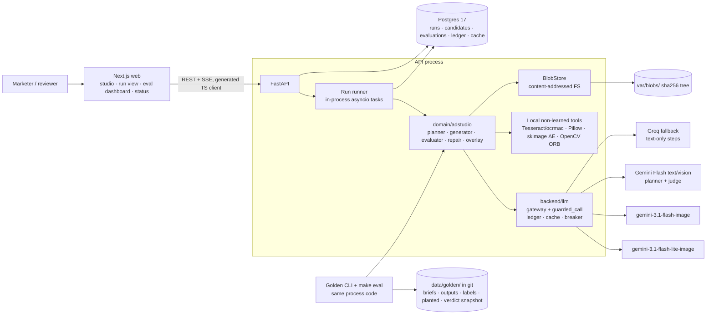
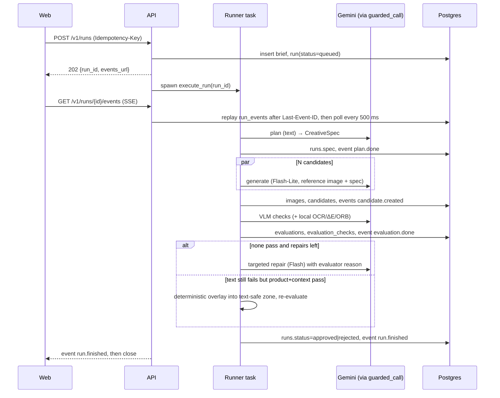
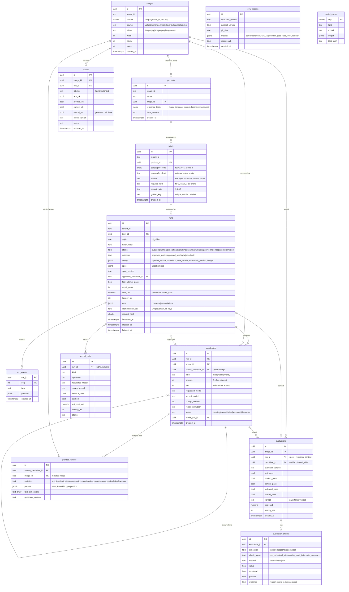

# Architecture — Ad Studio

Scope: components, data model, API contract, sync/async split, failure modes, scaling and observability for the PRD
musts (T1–T4, C1, M1–M3). The model pipeline internals (prompts, rubric, thresholds, repair wording) belong to
`docs/ai-design.md`. This document gives them typed seams (see "Extension points for AI design").

Shape: decision-table **G** (content generation with quality constraints), pattern ladder **rung 2** (fixed workflow,
ADR-001). Stack: the locked scaffold (FastAPI + Postgres/pgvector +
Next.js). The only additions are three libraries named in the stack's "Images" row: Pillow,
scikit-image/OpenCV and Tesseract/ocrmac. **No new processes, queues or stores** are added.

## PRD must → user action → backend operation
| Must | User-visible action | Backend operation | Endpoint(s) | Table(s) |
|---|---|---|---|---|
| T1b | Upload a product photo | Validate, normalise, content-hash and store the image; extract reference facts once | `POST /v1/products` | `images`, `products` |
| T1c | Fill in geography, season and required text | Validate the typed brief and create it with the run | `POST /v1/runs` | `briefs`, `runs` |
| T1d, M2 | See "effective season: summer (southern hemisphere)" | Planner step writes the `CreativeSpec` to `runs.spec` and emits `plan.done` | `GET /v1/runs/{id}/events` | `runs.spec`, `run_events` |
| T1a, T2, C1 | Watch candidates appear | Generator calls Gemini 3.1 Flash-Lite / Flash Image through `guarded_call`, caps the long edge at 1024 px and stores the blob | SSE + `GET /v1/images/{id}` | `candidates`, `images`, `model_calls` |
| M1, T4a–c | See a scorecard per candidate, with reasons | Evaluator writes one row per check (deterministic first, then VLM) | SSE + `GET /v1/runs/{id}` | `evaluations`, `evaluation_checks` |
| M1, T1e | See "rejected: rendered 'Summr'" → repair → approved | Targeted repair creates a child candidate. The text fallback overlays exact text into the reserved zone | SSE | `candidates.parent_candidate_id`, `candidates.kind` |
| M3 | See the approved ad, its cost and latency | Run reaches `approved`. Cost and latency are rolled up from the ledger | `GET /v1/runs/{id}` | `runs`, `model_calls.run_id` |
| T3 | (offline) ≈20 pipeline outputs with a stored report | Golden CLI runs the same pipeline over `data/golden/briefs.yaml` | `make golden-run`, `make eval` | `runs.origin='golden'`, `eval_reports` |
| T4, M3 | Evaluator dashboard: per-dimension P/R, planted failures caught | Meta-eval compares evaluator verdicts with labels. The dashboard reads the latest report and items | `GET /v1/evals/summary`, `GET /v1/evals/items` | `labels`, `planted_failures`, `evaluations`, `eval_reports` |
| Should | Label the ≈20 natural outputs in the UI | Upsert a human label | `PUT /v1/evals/items/{image_id}/label` | `labels` |

## Context diagram


### Run sequence (one ad)


## Components
| Component | Responsibility | Owns data | Talks to |
|---|---|---|---|
| **Web: Studio** (`apps/web/src/app/page.tsx`) | Upload product, brief form (country picker, season combobox, required text, aspect ratio), start run | none | `POST /v1/products`, `POST /v1/runs` |
| **Web: Run view** (`/runs/[id]`) | Live timeline from SSE (plan → candidates → scorecards → repair → fallback → approved), reload-safe via `GET /v1/runs/{id}` | none | SSE, `GET /v1/runs/{id}`, `GET /v1/images/{id}` |
| **Web: Evaluator dashboard** (`/evals`) | Per-dimension P/R/F1, agreement, first-attempt vs after-repair pass rate, text-exact rate, $/ad, p50; planted-failure gallery (TP/FN/FP) | none | `GET /v1/evals/summary`, `GET /v1/evals/items` |
| **Web: Status** (`/status`, exists) | Ledger health + run metrics | none | `GET /v1/ops/summary` |
| **API routers** (`http/routes/{products,runs,images,evals}.py`) | Validation, tenancy dependency, problem+json, SSE | none | repositories, runner |
| **Run runner** (`backend/jobs/runner.py`) | Admission control (global run semaphore, queue cap), spawn/track asyncio tasks, heartbeat, startup recovery, event append | `runs.status`, `run_events` | pipeline, DB |
| **Pipeline orchestrator** (`domain/adstudio/pipeline.py`) | Fixed state machine: plan → generate×N → evaluate → repair (≤ max) → text fallback → approve/reject; per-run `Budget` | `candidates`, `runs` outcome fields | planner, generator, evaluator, repairer, overlay |
| **Planner** (`domain/adstudio/planner.py`) | Brief + product facts → `CreativeSpec` (deterministic hemisphere/season resolver + LLM for locale cues) | `runs.spec` | text gateway |
| **Generator** (`domain/adstudio/generator.py`) | Image calls via `guarded_call(kind="image")`, model routing, resolution cap (decode → assert → downscale), blob write, image cache | `images` rows (source=generated) | google-genai, BlobStore |
| **Evaluator** (`domain/adstudio/evaluator/`) | Pure function `(image, reference, spec, facts, cache) → Evaluation`; text (OCR CER + critical tokens + VLM read-back), product (bbox crop, ΔE, ORB inliers, VLM checklist), context (VLM binary rubric), technical | `evaluations`, `evaluation_checks` (persisted by caller) | local tools, vision gateway |
| **Repairer / Overlay** (`domain/adstudio/{repair,overlay}.py`) | Evaluator reason → targeted edit instruction; Pillow text render into `spec.text_zone` with a script-appropriate font | `candidates` (kind=repair/overlay) | generator, BlobStore |
| **BlobStore** (`backend/storage/blobs.py`) | `put(bytes) → sha256`, `open(sha256)`, content-addressed under `BLOB_DIR` (ADR-003) | files under `var/blobs/` | filesystem |
| **LLM layer** (exists: `backend/llm`) | Gateway (text, pydantic-ai, fallback), `guarded_call` (image/vision), ledger, cache, breaker | `model_calls`, `model_cache` | Gemini, Groq |
| **Golden CLI** (`backend/cli.py`) | `golden run / export / import / plant`, same `execute_run` as the API (ADR-004) | `data/golden/` files | pipeline, DB, BlobStore |
| **Eval suites** (`services/api/evals/suites/{evaluator_meta,pipeline_quality}.py`) | Meta-eval P/R/F1 per dimension, human agreement, pass rates, text exactness, $/ad, latency → markdown report + `eval_reports` row | `evals/reports/*.md`, `eval_reports` | evaluator (offline), DB (optional) |

### Scaffold changes required (small, flagged)
1. `model_calls.run_id uuid NULL` (indexed), set from a `run_id` contextvar in `record_call`. This gives exact cost and
   latency per run and per approved ad (about 20 min).
2. `guarded_call(..., timeout_s=)` override, because image calls need about 60 s and text calls keep 30 s (about 10 min).
3. `format_event` emits `id: <seq>` when the event carries a sequence number, so SSE can resume with `Last-Event-ID` (about 10 min).
4. `FileCache` implementing `CacheStore`: a read-only JSON snapshot used by tests and `make eval`, where a cache miss
   is an error. Together with a pytest fixture that blocks sockets, this makes "0 network calls" enforced rather than
   hoped for (about 30 min).
5. Image-model settings: `IMAGE_MODEL_CANDIDATE`, `IMAGE_MODEL_REPAIR`, `VISION_JUDGE` in `.env`. The current
   `LLM_JUDGE=groq:openai/gpt-oss-120b` is **text-only** and cannot judge images, so the vision judge must be Gemini
   (see Failure modes).

## Data model


Notes
- **Tenancy:** there is a single demo tenant. `tenant_id text NOT NULL DEFAULT 'demo'` is on `images`, `products`,
  `briefs` and `runs`. Child tables (`candidates`, `run_events`, `evaluations`, `labels`) reach their tenant through
  `run_id`/`image_id`. Every repository function takes `tenant_id`. A `get_tenant()` dependency returns the
  configured demo tenant, and swapping it for OIDC claims is the upgrade path. Multi-tenant auth is a PRD *Won't*.
- **Indexes:** `runs(tenant_id, created_at DESC, id)` for cursor pagination; `runs(status) WHERE status NOT IN
  (terminal)` for recovery; `unique runs(tenant_id, idempotency_key)`; `run_events` PK `(run_id, seq)` covers
  replay; `candidates(run_id, attempt, slot)`; `unique evaluations(image_id, run_id, evaluator_version)`, which acts
  as the idempotency and cache key for re-evaluation; `evaluation_checks(evaluation_id)`; `unique labels(image_id,
  labeller)`; `unique briefs(golden_key)`; `model_calls(run_id)`.
- **jsonb is used only where the payload varies by version:** `runs.spec` (validated by the `CreativeSpec` Pydantic
  model plus `spec_version`), `runs.config`, `products.reference_facts`, `run_events.payload` (the `RunEvent` union),
  `planted_failures.params`, `eval_reports.metrics`. Pass/fail per dimension is kept in typed columns because the
  meta-eval queries it.
- **No vector columns.** No PRD must needs retrieval or similarity search. The product-identity check uses ORB keypoints
  in process, not stored embeddings. pgvector stays installed but unused.
- **Invariants enforced in code and tested:** every `images` row with `source ∈ {generated, repair, overlay}` has
  `max(width, height) ≤ 1024` (C1); `runs.approved_candidate_id` is set only if that candidate's latest evaluation
  has `overall_pass = true`; `briefs.required_text` is stored byte-exact after NFC and is never rewritten.
- Migration: `0002_adstudio` (forward-only, with a matching downgrade), all tables above plus `model_calls.run_id`.

## API contract (first version)
All paths are versioned under `/v1`. Every non-2xx response is RFC 9457 problem+json. The OpenAPI spec is the contract
(`make contract` regenerates `apps/web/src/lib/api`). List endpoints use cursor pagination: `?limit=` (1–100, default
20) and `?cursor=`, returning `{items, next_cursor}`, with the cursor opaque over `(created_at, id)`.

| Method | Path | Request | Response | Notes (streaming, idempotency, auth) |
|---|---|---|---|---|
| POST | `/v1/products` | multipart `ProductCreate{name}` + `image` file | 201 `Product{id, name, image_url, reference_facts, created_at}` | Upload allowlist png/jpeg/webp, ≤ 10 MB, decodes, short edge ≥ 256 px. EXIF is stripped and orientation applied. Idempotent by content: the same bytes return the existing product (200). Reference facts are extracted synchronously (one vision call, cached, about 3 s) |
| GET | `/v1/products` | `limit, cursor` | `Page[Product]` | Studio picker, including golden products |
| POST | `/v1/runs` | `RunCreate{product_id, geography_code, geography_detail?, season, required_text, aspect_ratio="4:5", fresh=false}` | 202 `RunAccepted{run_id, brief_id, status, events_url}` | **`Idempotency-Key` required.** The same key and body return the original run (200). The same key with a different body returns 409 `idempotency-conflict`. When the runner queue is full, returns 429 `run-queue-full` with `Retry-After`. `fresh=true` salts the image cache keys so a repeated brief makes new images |
| GET | `/v1/runs/{run_id}/events` | header `Last-Event-ID?` | `text/event-stream` of `RunEvent` | **SSE.** Replays events with `seq > Last-Event-ID`, then tails. Keep-alive every 15 s. Closes after `run.finished`. Works after the run has ended (full replay) |
| GET | `/v1/runs/{run_id}` | — | `RunDetail{run, brief, spec, candidates[CandidateView{…, image_url, evaluation: EvaluationView{dimensions, checks[]}}], approved, cost_usd, latency_ms}` | Source of truth for reloads and history. The UI rebuilds the timeline from here if the SSE connection drops |
| GET | `/v1/runs` | `origin?, status?, limit, cursor` | `Page[RunSummary]` | History and golden gallery |
| GET | `/v1/images/{image_id}` | — | image bytes | `Content-Type` from the allowlist, `ETag: sha256`, `Cache-Control: private, max-age=31536000, immutable`, `X-Content-Type-Options: nosniff`. Tenant-scoped lookup |
| GET | `/v1/evals/summary` | `evaluator_version?` | `EvalSummary{report_id, created_at, evaluator_version, dataset_version, per_dimension{text,product,context: {precision, recall, f1, n}}, human_agreement, first_attempt_pass_rate, after_repair_pass_rate, native_text_rate, text_exact_rate, cost_per_approved_ad, p50_latency_to_approved_ms, targets}` | Latest `eval_reports` row. Returns 404 `no-eval-report` before the first `make eval` |
| GET | `/v1/evals/items` | `origin=natural\|planted, dimension?, outcome=tp\|fp\|fn\|tn?, limit, cursor` | `Page[EvalItem{image_url, source_image_url?, mutation?, label, verdict, per-dimension pass, top evidence}]` | Planted-failure gallery and drill-down. Computed as labels ⋈ evaluations for the latest evaluator version |
| PUT | `/v1/evals/items/{image_id}/label` | `LabelUpsert{text_ok, product_ok, context_ok, notes?, rubric_version}` | 200 `Label` | *Should* (labelling UI). Idempotent by `(image_id, labeller)`. Written back to `data/golden/labels.csv` by `make golden-export` |
| GET | `/v1/ops/summary` | `window` | `OpsSummary` + `runs{count, approved_rate, first_attempt_pass_rate, mean_repairs, overlay_rate, cost_per_approved_ad, p50_ms_to_approved, p95_ms_to_approved, active, queued}` | Extends the existing endpoint |
| GET | `/v1/meta/run-events` | — | JSON Schema of the `RunEvent` union | Types the SSE payloads for the TS client (mirrors the existing `/v1/meta/stream-events`) |

**`RunEvent` union** (discriminator `type`, every event carries `seq`, `run_id` and `at`):
`run.status{status}` · `plan.done{spec_summary{effective_season, hemisphere, locale_cues[], text_zone}}` ·
`candidate.created{candidate_id, attempt, slot, kind, image_url, model, cached}` ·
`evaluation.done{candidate_id, verdict, dimensions{text,product,context,technical:{pass, reasons[]}}}` ·
`repair.started{from_candidate_id, target_dimension, instruction}` · `fallback.applied{candidate_id, reason}` ·
`budget.warning{spent_usd, cap_usd}` · `run.finished{status, outcome, approved_candidate_id?, cost_usd, latency_ms}` ·
`run.error{problem}`.

**Error types:** `validation-error` (422), `unsupported-media-type` (415), `payload-too-large` (413), `not-found`
(404), `idempotency-conflict` (409), `rate-limited` / `run-queue-full` (429 + `Retry-After`), `model-unavailable`
(503), `budget-exceeded` (reported in-run as `run.error`, never as an HTTP error after the 202).

**Input rules for `RunCreate`:** `geography_code` must be in the ISO 3166-1 list; `season` is 1–40 characters (the
UI offers months and season names, and free text such as "Diwali" is allowed and left to the planner);
`required_text` is 1–80 characters after NFC, at most 3 lines, with no control characters except `\n`. It is treated
as **data, never instructions**: wrapped with `wrap_untrusted` for the planner and quoted literally in image prompts.
Injection heuristics flag the text but do not rewrite it (the PRD says it is rendered exactly as given).

## Sync vs async
| Work | Where | Why |
|---|---|---|
| Upload + normalise + reference-facts extraction | In the request (about 3 s, cached by image hash) | Needed before a brief can be planned. Short. On a vision outage, the product is saved with `reference_facts=null` and computed lazily at the first run |
| Generation run (plan → generate → evaluate → repair → fallback) | **Async**: `POST` returns 202; an in-process asyncio task runs `execute_run(run_id)`; progress goes to `run_events`; the client tails SSE (ADR-002) | 30–90 s and several model calls. It must survive a closed browser tab, allow replay, and be driven the same way by the CLI |
| Golden batch (≈20 briefs) | CLI process calls the same `execute_run` with `asyncio.gather` under a concurrency cap of 3 | Batch-sized, offline. It writes to the same DB, so its runs show up in the UI (the SSE tail polls the DB) |
| Evaluator tests and `make eval` meta-eval | Offline, in process, no DB required, `FileCache` verdict snapshot | T4 requires tests that are deterministic and use no network |
| Dashboard and ops reads | Sync | Plain queries |

Runner rules: a global semaphore of `RUNS_MAX_CONCURRENT=4` executing runs, plus the existing per-provider semaphore in
`guarded_call`. `POST` returns 429 when more than 20 runs are queued. Heartbeat every 5 s. On startup, any run that
is not terminal and has `heartbeat_at` older than 60 s becomes `interrupted` with a `run.error` event. Re-submitting
the brief is cheap because the plan, images and verdicts come back from `model_cache`.

Per-run budget, enforced through `Budget` plus a ledger check: at most 5 image calls, at most $0.35 hard stop
(the target is $0.25 per approved ad), and a 180 s deadline. If a limit is hit, the run ends `rejected` with the best
candidate's scorecard. It never auto-approves.

## Failure modes
| Failure | Detection | Behaviour | User sees |
|---|---|---|---|
| Image model 429 / 5xx / timeout | `guarded_call` retryable classification | Jittered retries (max 2), then the other image model (Flash-Lite ↔ Flash) recorded as `fallback_used`, then the breaker opens after 5 consecutive failures | The candidate card shows "retrying" and the served model name. If both models fail: `run.error model-unavailable`, run `failed`, "Image model unavailable — try again; cached demo runs are in History" |
| Image model returns no image / blocked by safety | Empty `output_image` or a finish reason | Counts as a failed candidate with reason `generation_blocked`. A repair slot is used with a neutral rephrase. It is never retried more than the budget allows | A card saying "Model returned no image (safety)" |
| Output larger than 1K or wrong aspect ratio | Post-decode assert in the generator; `technical` check | Downscale to a long edge of 1024 (Lanczos) before the blob write; aspect mismatch fails the `technical` check and triggers a repair | Technical row on the scorecard |
| Vision judge (Gemini) down | Breaker / error from the vision call | Deterministic checks still run. VLM checks are marked `unverified` and the verdict is `unverified`. **Fail closed:** no auto-approval; the run ends `rejected`, needs review | "Context check unavailable — not auto-approved" |
| Planner LLM down | Gateway error after fallback (Groq text fallback is allowed for planning) | The deterministic resolver still provides season and hemisphere; locale cues come from the fallback model or a minimal template | Plan card shows "fallback planner" and the model name |
| Invalid structured output (spec or verdict JSON) | Pydantic validation in pydantic-ai | One output retry; then the step fails and the run is `failed` (plan) or the check is `unverified` (judge) | Error with reason |
| OCR engines disagree | Tesseract ≠ ocrmac beyond a tolerance | Text **fails** (a VLM read-back can never pass text, per veto-not-pardon); the disagreement is recorded as evidence and routes to text repair / overlay | "OCR disagreement — text not verified" |
| Text still wrong after repairs | Text dimension fails, product and context pass | Deterministic overlay into `spec.text_zone`, then re-evaluate (OCR must pass). Outcome `approved_overlay` | "Text rendered by fallback overlay" badge; native-render rate is reported separately |
| Product or context still wrong after max repairs | Dimension fails after `max_repairs` | Run `rejected`, with the best candidate and its reasons | Rejected banner with reasons; no approved ad |
| Budget or deadline exceeded | `Budget.charge` / ledger sum | Stop; run `rejected` | `budget.warning`, then the reason |
| DB down | `/ready` fails; SQLAlchemy errors | API returns 503 problem+json. A run in flight fails its next write, and the task ends and marks `interrupted` on restart. Offline evals and tests are unaffected | "Service unavailable" |
| API restart mid-run | Stale heartbeat on startup | Run `interrupted`; re-submit hits the cache | Run view shows "Interrupted — re-run" |
| SSE connection drops | Client `fetch` stream ends early | Client reconnects with `Last-Event-ID` and gets the replay from `run_events` | Seamless; the timeline fills in |
| Bad upload (type, size, corrupt, tiny) | Allowlist + Pillow decode + min size | 413/415/422 problem+json | Inline form error |
| Prompt injection in `required_text` | Heuristics in `guardrails/input` | Rendered literally, never obeyed; a flag is stored in `runs.config.input_flags` | "Text treated as literal" note (demo moment) |
| Disk full / blob write fails | `OSError` in BlobStore | Candidate fails with `storage-error`, run `failed` | Error with reason |
| Missing `GOOGLE_API_KEY` / billing off | `/ready` provider check; 403 from the API | Runs are refused with 503 `model-unavailable`. Golden runs, evals and tests still work from committed artifacts | Status page shows "image provider not configured" |

## Scaling path
The bottleneck is **image-model quota and cost**, not CPU. At about $0.15 per approved ad (2 × Flash-Lite at $0.034,
about 30% needing one Flash repair at $0.067, plus judge calls of about $0.005 each), 10k ads per month is about
$1.5k.
1. **Move runs out of process.** Swap the in-process runner for `procrastinate` (Postgres-backed queue, already the
   stack's optional module) plus a `worker` process. `execute_run(run_id)` does not change, and the API becomes
   stateless and scales on Cloud Run. Replace SSE polling with Postgres `LISTEN/NOTIFY`.
2. **Object storage.** The BlobStore FS implementation becomes GCS/S3 with signed URLs, using the same interface and
   the same sha256 keys, so there is no data migration beyond copying blobs.
3. **Quota management.** Use per-tenant budgets and priority queues. Send the offline and bulk localisation work
   (a campaign × 30 markets) through the **Gemini Batch API** at about half price. Move the rate limiter and breaker
   to Redis.
4. **Cut calls per ad.** Route by difficulty: N=1 when the planner marks a brief as easy, and use deterministic checks
   to reject early so no VLM call is spent on obvious failures. Cache plans per (geography, season, product). Tune
   thresholds per placement from the meta-eval.
5. **Human review queue and drift.** Send `unverified` and borderline verdicts to reviewers, and feed their labels
   back into `labels`. Track evaluator pass-rate drift per model version. Add CTR A/B testing as the online metric.

## Observability
- **Spans** (OTel → Phoenix): `run {run_id, origin}` → `step.plan | step.generate | step.evaluate | step.repair |
  step.overlay {attempt, slot}` → `model_call {operation, requested_model, served_model, cached}` (exists) and
  `check {dimension, check_name, passed}` for local checks (OCR, ΔE, ORB timings).
- **Log fields** (structlog JSON): `request_id`, `trace_id`, `run_id`, `candidate_id`, `step`, `attempt`,
  `dimension`, `verdict`, `model`, `cost_usd`, `latency_ms`, `budget_spent_usd`. `required_text` is never logged at
  INFO; only its length and hash are.
- **Status page** (`/v1/ops/summary`): the existing ledger numbers (p50/p95 per call, cache hit rate, fallback rate,
  error rate, total $) plus run numbers: approved rate, first-attempt vs after-repair pass rate, overlay rate, mean
  repairs, **cost per approved ad**, **p50/p95 time to approved ad**, active and queued runs, breaker state per model.
- **Eval dashboard** (`/v1/evals/summary`): per-dimension precision/recall/F1 against targets (≥ 0.90 / ≥ 0.85),
  human agreement (≥ 85%), text-exact rate (100%), native-text rate, evaluator version and dataset version.

## Offline batch and eval path (T3, T4)
Source of truth is git (ADR-004):
```
data/golden/
  SOURCES.md                 product photo provenance + licences
  products/*.png             4–6 reference products
  briefs.yaml                ≈20 briefs (golden_key, product, geography, season, required_text, aspect) covering both
                             hemispheres, equatorial, all seasons, prices/percentages, long text, one non-Latin, one injection
  outputs/manifest.jsonl     one line per natural output: image sha, golden_key, run spec, candidate kind/attempt
  outputs/*.png              the ≈20 natural outputs (the first-attempt candidates, so natural failures are included) + approved ads
  labels.csv                 human labels per image (text_ok, product_ok, context_ok, rubric_version, notes)
  planted/manifest.jsonl     mutation, source sha, params (seed), fails_dimensions
  planted/*.png              only the non-reproducible ones (season_contradiction); pure Pillow mutations are regenerated from params
  cache/verdicts.json        snapshot of model_cache entries the evaluator needs (VLM checks, bbox) → FileCache
```
| Step | Command | Network | Writes |
|---|---|---|---|
| 1. Generate | `make golden-run` → `python -m backend.cli golden run` (idempotent per `golden_key` + pipeline version) | yes (cached after the first run) | DB runs (`origin=golden`), blobs |
| 2. Export | `make golden-export` | no | `outputs/`, `manifest.jsonl`, `cache/verdicts.json`, `labels.csv` (from DB labels) |
| 3. Label | Edit `labels.csv`, or use the labelling UI then export | no | `labels.csv` |
| 4. Plant | `make plant` (seeded Pillow mutations: typo overlay, text cover, hue shift in product bbox, product swap, oversize; season contradiction generated once via a contradicting brief) | only for season_contradiction, cached | `planted/` |
| 5. Refresh verdicts | `make eval-record` (evaluator over natural + planted items with a live cache, then snapshot) | yes | `cache/verdicts.json` |
| 6. Measure | `make eval` (FileCache, sockets blocked) | **no** | `evals/reports/<ts>.md`; an `eval_reports` row if the DB is reachable |
| 7. Show | `make golden-import` loads manifests, labels and planted items into the DB for the dashboard | no | `images`, `labels`, `planted_failures`, `evaluations` |

`pytest` (`make check`) uses the same files, including `test_evaluator_flags_text_typos`, `…_recoloured_product`,
`…_season_contradiction`, `test_passes_known_good`, `test_resolution_cap` and `test_planner_hemisphere`. These tests
need no DB and no network.

## Extension points for AI design
`docs/ai-design.md` does not exist yet. These typed seams are fixed so it can fill them in without changing the system
design:
- `Planner.plan(brief: BriefIn, facts: ReferenceFacts | None) -> CreativeSpec`. `CreativeSpec` must include
  `effective_season`, `hemisphere`, `locale_cues[]`, `palette[]`, `text_zone{x,y,w,h}` (normalised),
  `required_text` (verbatim), `aspect_ratio`, `avoid[]` and `rubric[]` (the binary context checks).
- `Generator.generate(spec, reference: bytes, *, attempt, slot, model, repair: RepairPlan | None) -> GeneratedImage`.
- `Evaluator.evaluate(image: bytes, reference: bytes, spec, facts) -> Evaluation`. This is pure and has no DB access.
  `Evaluation.checks[]` maps 1:1 to `evaluation_checks`.
- `Repairer.plan(evaluation, spec) -> RepairPlan{target_dimension, instruction, model}`.
- `Overlay.render(image, spec.text_zone, text, script) -> bytes`.
- `PipelineConfig{n_candidates, max_repairs, candidate_model, repair_model, thresholds_version, budget}` is stored in
  `runs.config`.

## Feasibility (minutes; no code freeze)
| Component | Owner | Min |
|---|---|---|
| Migration `0002_adstudio`, SQLAlchemy models, repositories with tenant scoping | system | 75 |
| Scaffold changes 1–5 (ledger `run_id`, timeout override, SSE ids, FileCache + no-network fixture, settings) | system | 70 |
| BlobStore + `/v1/images` + upload validation + `/v1/products` | system | 75 |
| Run runner (admission, tasks, heartbeat, recovery, event log, SSE replay/tail, idempotency) | system | 110 |
| Pipeline orchestrator state machine + budget + `RunDetail` assembly | system | 100 |
| Generator adapter (google-genai spike, guarded_call, image cache via blobs, 1K cap) | system/AI | 75 |
| Planner (deterministic resolver + LLM spec) | AI | 60 |
| Evaluator: deterministic (OCR ×2, CER/tokens, bbox crop, ΔE, ORB, technical) | AI | 150 |
| Evaluator: VLM checks + read-back + caching | AI | 75 |
| Repairer + overlay (fonts, scripts, text zone) | AI | 90 |
| Golden CLI (run/export/import/plant) + briefs.yaml + product photos | system | 150 |
| Eval suites (meta-eval, pipeline quality) + `eval_reports` + `/v1/evals/*` + ops extension | system | 120 |
| Tests (unit + integration + evaluator suite) | both | 150 |
| Web: studio form + upload | web | 75 |
| Web: run view with SSE timeline, scorecards, lineage | web | 150 |
| Web: eval dashboard + planted gallery; status additions | web | 120 |
| Web: labelling UI (*Should*) | web | 60 |
| **Total** | | **≈1,765 min (≈29.5 h)** |

This fits: the timeline has no freeze and asks for completeness. If the clock tightens again, cut in this order: the
labelling UI (edit the CSV instead), `GET /v1/runs` history, then the SSE replay (keep only live tail plus
`GET /v1/runs/{id}` on reload).

## ADRs
- ADR-001: Fixed workflow (rung 2) as a persisted run state machine
- ADR-002: In-process async runs with a Postgres event log, streamed over SSE
- ADR-003: Images in a content-addressed filesystem store with metadata in Postgres
- ADR-004: Golden set and verdict snapshot in git; the DB is a projection for the UI

## Cross-doc reconciliation (Stage 2, main context)
These rules win over any conflicting wording in `ai-design.md`, `ux.md` or `production-readiness.md`.

| Topic | Conflict | Resolution |
|---|---|---|
| Naming | ai-design says `ad_jobs` / `/ads`, ux says `/v1/ads`, production-readiness says `/v1/ads/jobs` | The canonical names are **`runs`** and **`/v1/runs`** (this doc). Other docs' "job" or "ad" means a run |
| Human release | ux, ai-design and production-readiness require an approve/reject step; the API table had none | Add `POST /v1/runs/{run_id}/decision` `{action: approve\|reject, reason?}`. `reason` is required when approving a run that is `rejected`/needs review. The call writes an audit row and, for an override, a `labels` row (`labeller=human:<name>`). The gate only proposes; **export is always behind human approval** |
| Replay / cancel | ux needs a badged replay and cancel | Add `POST /v1/runs/{run_id}/replay`, which re-emits the stored `run_events` with their recorded inter-event timings, tagged `replay=true` on every event. Add `POST /v1/runs/{run_id}/cancel` |
| `required_text` limits | production-readiness says ≤ 60 chars; ai-design and architecture say ≤ 80 chars and ≤ 3 lines | **≤ 80 chars, ≤ 3 lines**, NFC, reject control/bidi/tag/zero-width chars (ZWJ/ZWNJ allowed). The overlay fit check (min 28 px) handles layout |
| Required text and models | architecture wrapped it for the planner; ai-design keeps it away from every text/vision model | **ai-design wins.** The required text never reaches the planner or judge. Code copies it into the spec, and it reaches the image model only as an escaped `«literal»` |
| Budget | production-readiness says $0.40/run; ai-design, ux and architecture say $0.25 | **Hard cap $0.25 per run** (worst case ≈ $0.23), ≤ 5 image calls, ≤ 150 s. Plus production-readiness's **$3/day** ledger cap and per-IP limits (10 runs/h, 2 concurrent) |
| Image-call retries | the scaffold uses a 30 s timeout with retries on timeout | Image calls: 60 s timeout, **no retry on timeout**, retry only on 429/5xx (max 2), never retry a safety block |
| Vision judge | `LLM_JUDGE` is a text-only Groq model | Add `VISION_JUDGE=google:gemini-…-flash` (a vision model). Startup fails if a vision role is set to a text-only model. If the judge is down, **fail closed** to needs-review |
| Judge authority | — | **Veto, not pardon** (all docs agree). Text and product pass only on deterministic checks; the VLM can add failures, never remove them |
| Customer images | — | Only the billed Google project receives images (startup check) |
| Status names | docs used `rejected`, `needs_review`, `held` interchangeably | `runs.status`: `queued → planning → generating → evaluating → repairing → fallback →` one terminal state: **`passed`** (gate passed, awaiting human approval), **`needs_review`** (gate could not pass it: exhausted repairs, budget, judge down; UI label "Held"), **`failed`** (system error), **`interrupted`**, **`cancelled`**. A human decision sets **`approved`** or **`rejected`**. `outcome` records `native \| overlay \| null` |
| Unsupported scripts | docs differed | Install `tesseract-lang` + `libraqm` (env slice). At input, if the overlay font set (Noto) lacks a glyph for `required_text` → 422 `unsupported-script`, because the text guarantee can't be kept |
| Demo vs dataset | the ux demo used a bottle; the dataset's AU brief used a mug | The demo uses **golden brief B01 (Australia / December)** and its product exactly; ux.md seed data follows `ai-design.md §9.1` |
| Injection brief (B20) | in the ≈20 natural outputs, its text is overlay-only | Kept in the natural set but **excluded from the native-text metrics** and reported separately as a red-team item |
